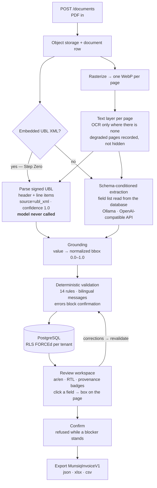

# Munsiq — منصق

Document information extraction for Saudi tax invoices, Arabic and English, for
the **receiving** side of ZATCA Phase 2.

A portfolio project, built as a working system rather than a demo: Postgres with
row-level security, a real extraction pipeline, a deterministic rules engine, a
bilingual review workspace with full RTL, and a versioned export.

---

## The problem

Under ZATCA's Phase 2 (Integration) rules, a Saudi standard tax invoice is
generated as UBL 2.1 XML, cleared by ZATCA, and shared with the buyer — very
often as a PDF/A-3 with that XML embedded as an attachment.

The **selling** side of this is solved, because it has to be: a supplier that
cannot issue a compliant invoice cannot get paid.

The **receiving** side is not. An accounts-payable team gets a PDF by email and
types it into an ERP: invoice number, dates, two VAT registrations, subtotal,
VAT, total, line items. Then somebody checks the arithmetic, or doesn't. The
generic answer is invoice OCR — read the picture, guess the fields, hope.

That answer ignores what is actually in the file. A compliant invoice **already
contains its own structured data**, exactly, signed by the seller. Munsiq is
built around that fact:

> Read the XML when it is there. Use a model only when it is not. Tag every
> value with where it came from. Check the arithmetic deterministically. Let a
> human see the page and the value side by side before anything leaves.

## Architecture



## Why this is not a CRUD app

**1. XML before AI.** Step Zero looks for the embedded UBL attachment before
anything else. When it is there the model is not called at all — not called and
discarded, *not called*. Values land with `source='ubl_xml'` and confidence 1.0
because they were read, not inferred. A test asserts the model is never invoked
on that path, using a client that raises if anyone tries.
When the model does run and disagrees with a signed value, the XML wins and the
disagreement becomes an `XML_PDF_MISMATCH` finding for a human.
→ [ADR 001](docs/adr/001-xml-first-extraction.md)

**2. The schema is input, not weights.** This repo started with a LoRA fine-tune
that emitted five fixed columns; adding a sixth field meant retraining. Now the
field list — keys, types, Arabic and English labels, required flags, per-field
guidelines — lives in `extraction_schemas.definition` and is read at request
time. The same rows build the prompt, label the review UI and label the export.
Adding a field is an `UPDATE`, not a training run.
→ [ADR 002](docs/adr/002-schema-conditioned-prompting.md)

**3. Every value carries its provenance.** Not just a value: `source`,
`confidence`, a normalized bounding box, the original pre-correction value, and
who reviewed it. The workspace renders that as a badge per field — green for a
signed XML value, amber with a confidence bar for a model reading, red where the
two disagree — and clicking a field highlights exactly where it appears on the
page. The export carries the same six attributes per field, so provenance
survives into whatever consumes it. A number without a source is the thing this
system refuses to produce.

**4. Tenant isolation in the database, with a negative control.** Every
org-scoped table has `org_id`, RLS `ENABLE`d **and** `FORCE`d, and one policy
per table (measured: 17 of 17 tables, 18 policies). The API layer contains no
`org_id` filter anywhere — deliberately, so that if RLS broke the tests would
see another tenant's rows and fail. And because an isolation test can pass for
the wrong reason, `test_postgres_role_bypasses_rls_control` asserts that a
`BYPASSRLS` role *does* see both tenants: if that control ever starts passing
isolation, the setup has stopped inserting data and the green suite is a lie.
→ [ADR 004](docs/adr/004-rls-force-and-negative-control.md)

## Measured

Real numbers from this machine. Nothing here is estimated.

| What | Measurement | How |
| --- | --- | --- |
| Backend test suite | **291 passed, 1 skipped, 1 xfailed — 18m14s** | full `pytest` run against Supabase Postgres 17, 2026-09-19 |
| Validation rules | **14** (10 blocking, 4 advisory) | `@rule` decorators across `app/services/validation/rules/` |
| Validation coverage | **100% statements and branches** — 445 statements, 148 branches, 0 missed | `pytest-cov --cov-branch` over `app/services/validation`, 97 tests in 21.9s |
| Export renderers | **18 tests, 2.3s**, no database | `tests/test_export_render.py` |
| Document A, compliant | **0 model calls**; 19 fields (11 header + 8 line-item cells); 9/11 header and 5/8 line cells grounded; no blockers; 29.8s end to end | `scripts/seed_demo_documents.py`, 2026-09-19 |
| Document B, model path | `qwen2.5:7b-instruct` via Ollama; **11/11 fields grounded**; confidences 0.857–1.000; 1 blocker (`GRAND_TOTAL_MISMATCH`); model 164.9s, pipeline 181.0s | same run, CPU inference |
| Tenant isolation | **17 of 17** org-scoped tables `ENABLE` + `FORCE`; 18 policies | live query against `pg_class` / `pg_policies` |

The ungrounded values on document A are honest gaps, not failures. The seller's
legal name is Arabic in the XML while the page prints the English trading name;
the second line's description is Arabic on the same English page; the
purchase-order number is not on that invoice at all; and the two line
quantities ("2", "4") are too short to locate safely — a box on the wrong "2"
is worse than no box. Each gets no bounding box rather than a wrong one, and
keeps its authority either way: the XML is what was signed, not the page.

## The review workspace

Bilingual, RTL-correct, dark. Provenance is the centrepiece.

**Document A — `ZATCA 4/4`, `Signed XML · no AI`, 18 of 19 values read straight
from the signed attachment:**


**The same document in Arabic. The layout mirrors, the labels come from the
schema, and the page image deliberately does not mirror:**


**Document B — no attachment, so the model ran: amber badges with confidence
bars, `ZATCA 1/1` because the other checks had nothing to check, and
`GRAND_TOTAL_MISMATCH` pinned above everything with Confirm refused:**


**And blocked in Arabic — the rule's message is written in both languages, not
translated at render time:**


A 90-second click path through it: [`docs/demo.md`](docs/demo.md).

## Export

`GET /api/v1/annotations/{id}/export?format=json|xlsx|csv`

One versioned contract, `MunsiqInvoiceV1`. `schema_version` is a literal, so a
consumer can pin to it. Every field carries `value`, `source`, `confidence`,
`bbox`, `reviewed_by` and `original_value`. XLSX and CSV are rendered **from**
that model by a shared flattening step, never assembled separately, so the three
formats cannot drift. XLSX has two sheets, Invoice and Line Items.

Only a confirmed annotation exports; anything else is a 409 explaining why, in
Arabic and English. Every export writes an `exports` row with a hash of the
bytes.

Invoice text is untrusted input, so a value like `=HYPERLINK(...)` is forced to
a string cell in XLSX (openpyxl would otherwise store it as a live formula) and
prefixed per OWASP in CSV. CSV is UTF-8 with a BOM, which is what makes Excel
read Arabic correctly.

## Quickstart

Windows, natively — no WSL, no Docker. Python via the `py` launcher; install
into the venv only.

```bash
py -m venv backend/.venv
backend/.venv/Scripts/python.exe -m pip install -e backend[dev]
```

Database and secrets:

```bash
cp backend/.env.example backend/.env    # then fill in DATABASE_URL and IMAGE_URL_SECRET
cd backend && .venv/Scripts/python.exe -m alembic upgrade head
```

Seed a tenant, its bilingual extraction schema, and the two demo documents:

```bash
cd backend
.venv/Scripts/python.exe -m scripts.seed_demo
.venv/Scripts/python.exe -m scripts.seed_demo_documents
```

Inference (only needed for documents without embedded XML):

```bash
ollama pull qwen2.5:7b-instruct
```

Run both halves:

```bash
cd backend && .venv/Scripts/python.exe -m uvicorn app.main:app --reload
```

```bash
cd frontend && npm install && cp .env.local.example .env.local && npm run dev
```

`MUNSIQ_ORG_ID` in `frontend/.env.local` comes from the `seed_demo` output; the
browser never sees it. Then open the URL `seed_demo_documents` printed.

Gates:

```bash
cd backend && .venv/Scripts/python.exe -m pytest -q && .venv/Scripts/python.exe -m mypy app && .venv/Scripts/python.exe -m ruff check app tests scripts
```

```bash
cd frontend && npm run verify
```

## What is deliberately not built

Stated plainly, because a portfolio project that pretends to be complete is
worse than one that says where it stops. Full detail in `CLAUDE.md`.

* **Authentication.** `get_current_org_id` raises 501 rather than guessing a
  tenant; the Next.js BFF holds the org identity server-side. The seam for a
  JWT is one function.
* **A durable queue.** Processing runs in a FastAPI background task, so there
  are no retries and no durability across a restart. `process_document` is a
  plain coroutine, so moving to arq is a call-site change.
* **Arabic OCR for image-only scans.** The OCR engine that loads under this
  machine's code-integrity policy has no Arabic. Affected pages are recorded as
  `ocr_unsupported_script` with a validation finding — loudly, not silently.
  Digital PDFs, the common ZATCA case, are unaffected.
* **A dedicated low-privilege database role.** The request path drops to a
  non-bypassing role per transaction; making the bypass unreachable rather than
  unused is a documented next step.
* **Line items from the model.** They come from the signed XML only.

Known bugs are tracked in `CLAUDE.md` under "Known issues" — including a
byte-identical re-upload crashing the pipeline, which is real and unfixed.

## Layout

```
backend/     FastAPI, SQLAlchemy 2.0 async, Alembic, the pipeline and rules
frontend/    Next.js 16 App Router, TypeScript strict, Tailwind, BFF routes
docs/        db.md · ingestion.md · validation.md · demo.md · adr/ · screenshots/
samples/     real invoices, git-ignored — never committed
src/         legacy synthetic-data prototype (docs/legacy-data-pipeline.md)
```

Architecture decisions: [`docs/adr/`](docs/adr/) —
[001 XML-first](docs/adr/001-xml-first-extraction.md) ·
[002 Schema-conditioned](docs/adr/002-schema-conditioned-prompting.md) ·
[003 Text layer first](docs/adr/003-text-layer-primary-ocr-fallback.md) ·
[004 RLS](docs/adr/004-rls-force-and-negative-control.md) ·
[005 Two-stage generation](docs/adr/005-two-stage-generation.md)
