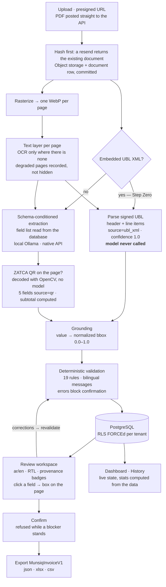
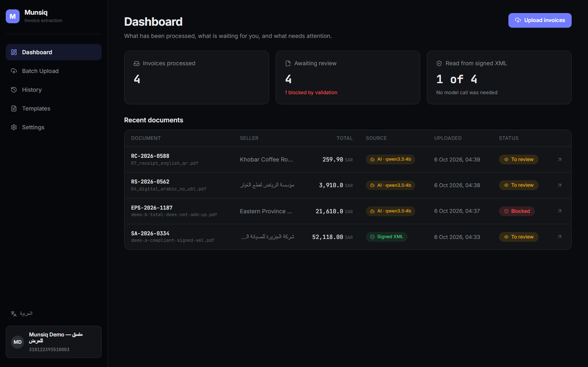
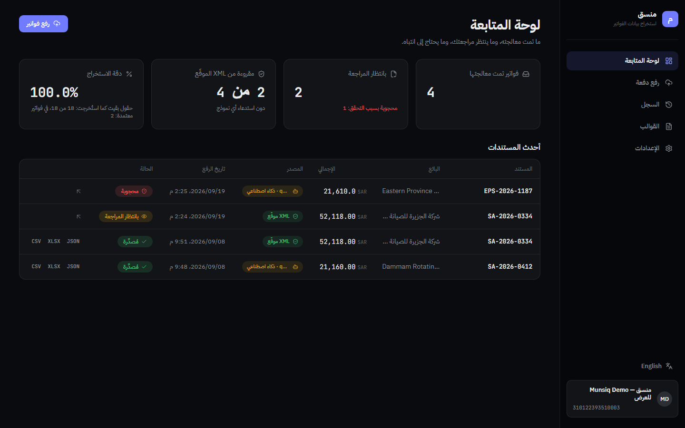
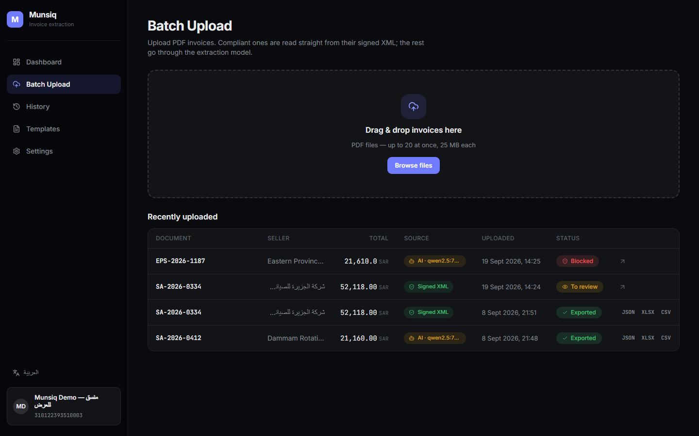
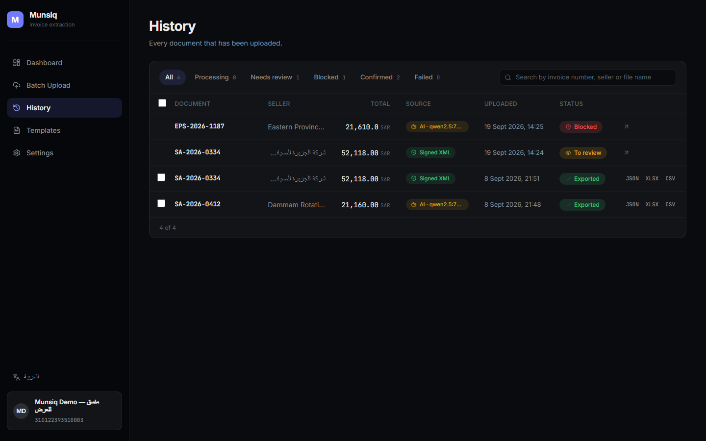
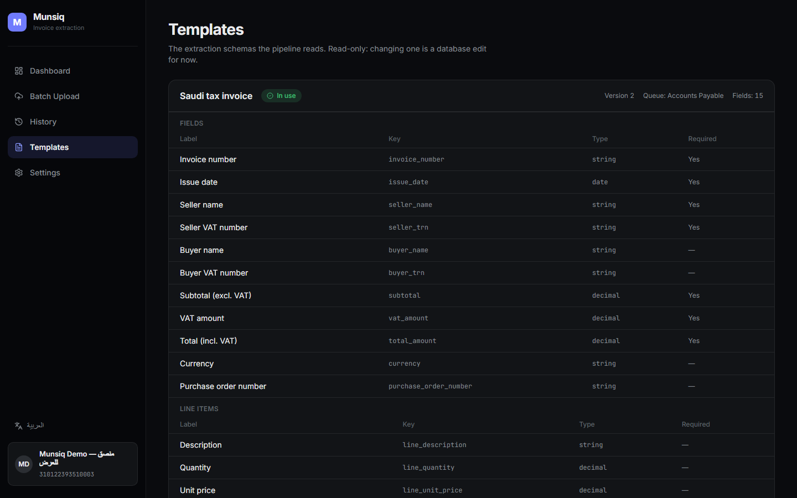
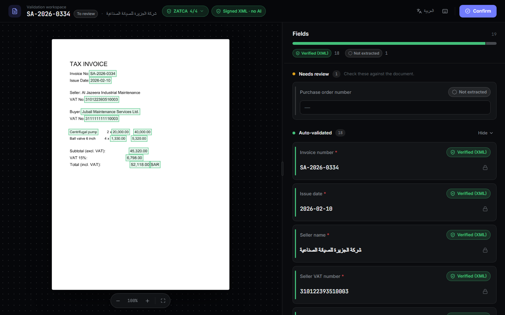
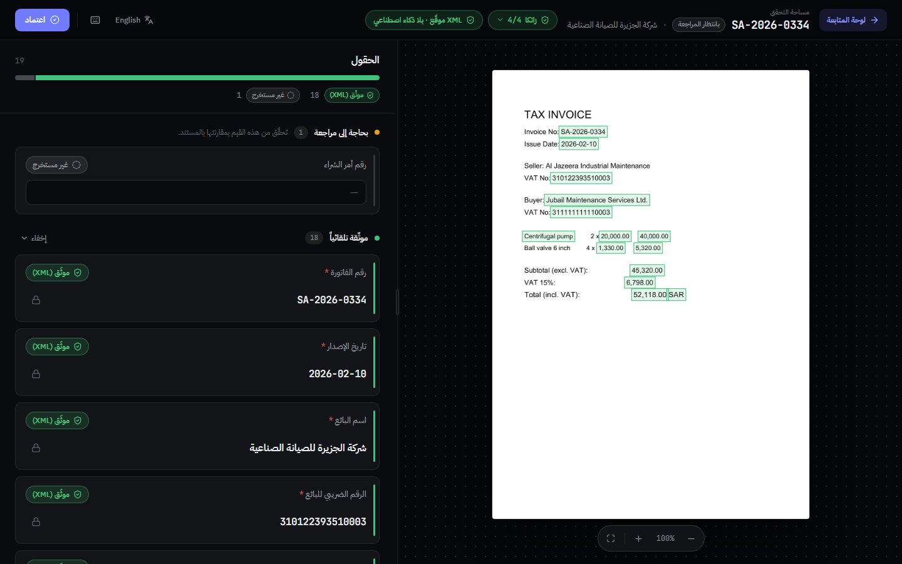
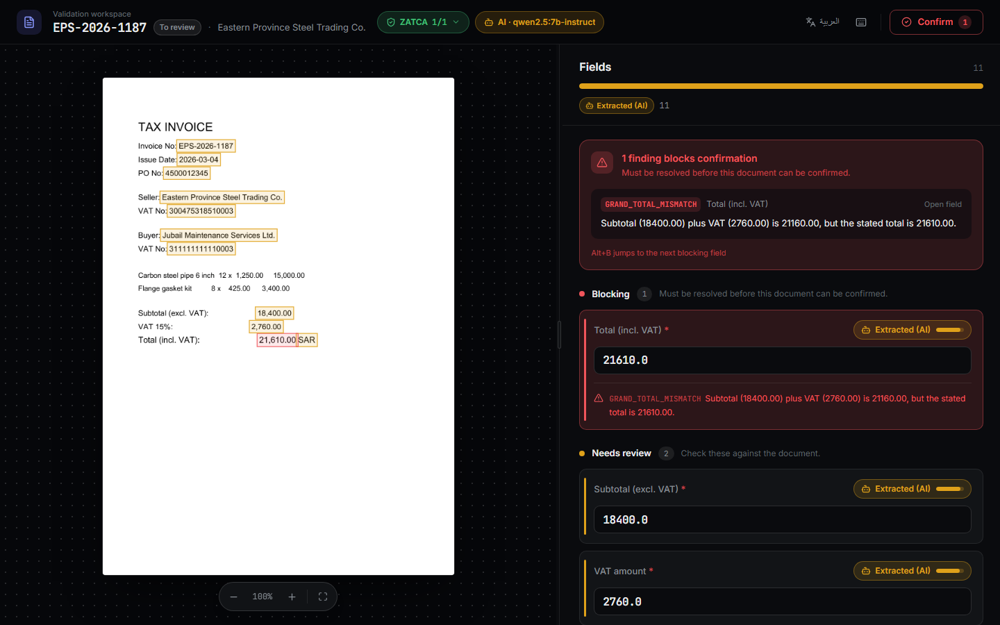
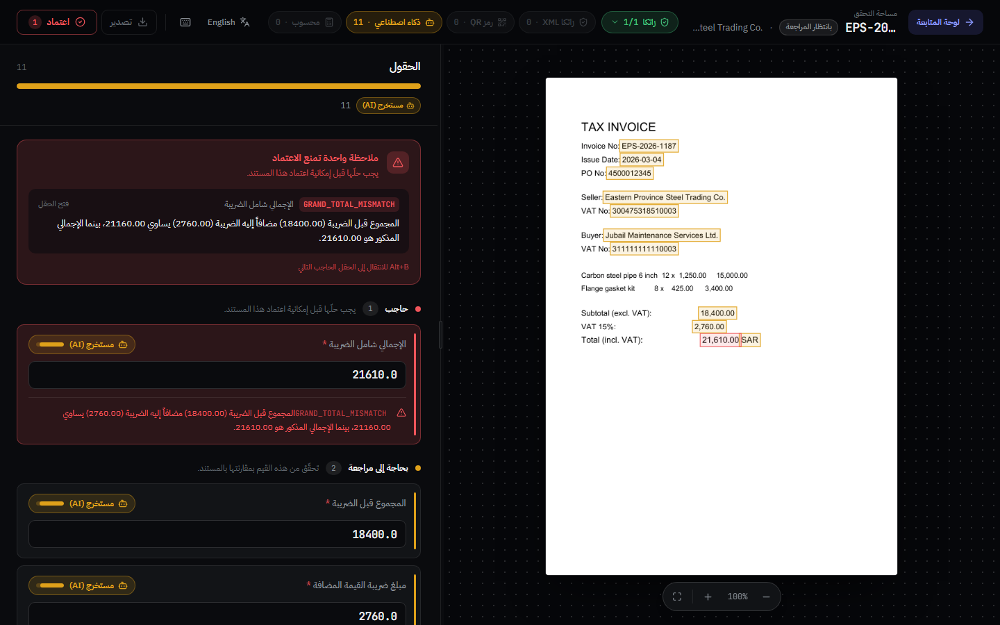

# Munsiq — منسق

Document information extraction for Saudi tax invoices, Arabic and English, for
the **receiving** side of ZATCA Phase 2.

A portfolio project, built as a working system rather than a demo: Postgres with
row-level security, a real extraction pipeline, a deterministic rules engine, a
bilingual review workspace with full RTL, and a versioned export.

**All processing is local.** Extraction runs on a local model served by Ollama
on `localhost`; QR decoding, OCR, grounding and validation are local code. No
cloud AI API is called, and the PDF and its page images are stored on this
machine (`STORAGE_DIR`) and never uploaded anywhere. Where the model is reached
is configuration — `INFERENCE_BASE_URL` and `VISION_INFERENCE_BASE_URL`, both
`http://localhost:11434` by default — and pointing either at another host would
send page text or page images there.

**One exception, stated plainly: the database.** In the setup measured here,
Postgres is a hosted Supabase instance, and it stores each page's text layer
and every extracted value — the contents of the document, if not the file. A
fully local deployment points `DATABASE_URL` at a Postgres on this machine;
nothing else changes.

---

## The problem

Under ZATCA's Phase 2 (Integration) rules, a Saudi standard tax invoice is
generated as UBL 2.1 XML, cleared by ZATCA, and shared with the buyer — very
often as a PDF/A-3 with that XML embedded as an attachment.

The **selling** side of this is solved, because it has to be: a supplier that
cannot issue a compliant invoice cannot get paid.

The **receiving** side is not. An accounts-payable team gets a PDF by email and
types it into an ERP: invoice number, dates, two VAT registrations, subtotal,
VAT, total, line items. Then somebody checks the arithmetic, or doesn't. The
generic answer is invoice OCR — read the picture, guess the fields, hope.

That answer ignores what is actually in the file. A compliant invoice **already
contains its own structured data**, exactly, signed by the seller. Munsiq is
built around that fact:

> Read the XML when it is there. Use a model only when it is not. Tag every
> value with where it came from. Check the arithmetic deterministically. Let a
> human see the page and the value side by side before anything leaves.

## Architecture



## Why this is not a CRUD app

**1. XML before AI.** Step Zero looks for the embedded UBL attachment before
anything else. When it is there the model is not called at all — not called and
discarded, *not called*. Values land with `source='ubl_xml'` and confidence 1.0
because they were read, not inferred. A test asserts the model is never invoked
on that path, using a client that raises if anyone tries.
When the model does run and disagrees with a signed value, the XML wins and the
disagreement becomes an `XML_PDF_MISMATCH` finding for a human.
→ [ADR 001](docs/adr/001-xml-first-extraction.md)

**2. The schema is input, not weights.** This repo started with a LoRA fine-tune
that emitted five fixed columns; adding a sixth field meant retraining. Now the
field list — keys, types, Arabic and English labels, required flags, per-field
guidelines — lives in `extraction_schemas.definition` and is read at request
time. The same rows build the prompt, label the review UI and label the export.
Adding a field is an `UPDATE`, not a training run.
→ [ADR 002](docs/adr/002-schema-conditioned-prompting.md)

**3. Every value carries its provenance.** Not just a value: `source`,
`confidence`, a normalized bounding box, the original pre-correction value, and
who reviewed it. The workspace renders that as a badge per field — green for a
signed XML value, amber with a confidence bar for a model reading, red where the
two disagree — and clicking a field highlights exactly where it appears on the
page. The export carries the same six attributes per field, so provenance
survives into whatever consumes it. A number without a source is the thing this
system refuses to produce.

**4. Tenant isolation in the database, with a negative control.** Every
org-scoped table has `org_id`, RLS `ENABLE`d **and** `FORCE`d, and one policy
per table (measured: 17 of 17 tables, 18 policies). The API layer contains no
`org_id` filter anywhere — deliberately, so that if RLS broke the tests would
see another tenant's rows and fail. And because an isolation test can pass for
the wrong reason, `test_postgres_role_bypasses_rls_control` asserts that a
`BYPASSRLS` role *does* see both tenants: if that control ever starts passing
isolation, the setup has stopped inserting data and the green suite is a lie.
→ [ADR 004](docs/adr/004-rls-force-and-negative-control.md)

## Measured

Real numbers from this machine. Nothing here is estimated.

| What | Measurement | How |
| --- | --- | --- |
| Backend test suite | **554 passed, 1 skipped, 1 xfailed — 28m31s** | full `pytest` run against Supabase Postgres 17.6, 2026-09-30. The skip and the xfail are one gap seen twice: there is no real ZATCA sample yet (see `samples/README.md`), and the suite says so instead of hiding it |
| Validation rules | **19** (10 blocking errors, 9 warnings) | counted from the rule registry (`engine._REGISTRY`), 2026-09-30 |
| Validation coverage | **100% statements and branches** — 601 statements, 204 branches, 0 missed | `pytest-cov --cov-branch` over `app/services/validation`, 2026-09-30; 165 tests, **6.3 s** without coverage instrumentation — 1.8 s for the rules alone (pure functions), the rest is `test_qr.py` rasterizing and decoding synthetic QR pages |
| Export renderers | **18 tests, 1.5s**, no database | `tests/test_export_render.py` |
| Tenant isolation | **17 of 17** org-scoped tables `ENABLE` + `FORCE`; 18 policies | live query against `pg_class` / `pg_policies`, 2026-09-20 |
| Document A, compliant | **0 model calls**; 19 fields (11 header + 8 line-item cells); 9/11 header and 5/8 line cells grounded; no blockers | queried from the database, 2026-09-20 |
| Document B, model path | `qwen2.5:7b-instruct` via Ollama; **11/11 fields grounded**; confidences 0.857–1.000; 1 blocker (`GRAND_TOTAL_MISMATCH`); model call **164.9 s** | queried from the database (`annotations.latency_ms` = 164,875), 2026-09-20 |
| Seed wall clock | A: 29.8 s, B: 181.0 s (pipeline, end to end) | printed by `scripts/seed_demo_documents.py` on 2026-09-19. **Not re-measured**, and which hardware the model ran on was not recorded |
| Live upload, through the UI | compact 7 KB compliant PDF: dropped → *Ready for review* in ≈33 s; an unreadable PDF → *Processing failed: … not a readable PDF* in ≈27 s | driven in the browser on 2026-09-20; sampled every 3 s, so ±3 s |

The ungrounded values on document A are honest gaps, not failures. The seller's
legal name is Arabic in the XML while the page prints the English trading name;
the second line's description is Arabic on the same English page; the
purchase-order number is not on that invoice at all; and the two line
quantities ("2", "4") are too short to locate safely — a box on the wrong "2"
is worse than no box. Each gets no bounding box rather than a wrong one, and
keeps its authority either way: the XML is what was signed, not the page.

## Results

One real invoice, scored against hand-entered ground truth: a two-page Arabic
B2B tax invoice from a Saudi contractor, no embedded XML, a clean text layer on
page 1 and a blank filler page 2. The invoice and its ground truth are
git-ignored personal data; only the scores are here.

Measured 2026-09-24 with `scripts/eval_set.py score`, nine header fields, the
full schema-conditioned prompt with field guidelines. Temperature 0, seed 0 and
`think: false` on every call. The vision run was repeated three times and
scored identically each time; that is repeatable here, not guaranteed, since
Ollama's prompt cache has been seen to change a value between a cold and a warm
run (recorded in `CLAUDE.md`).

| Field | Text path<br/>`qwen2.5:7b-instruct` | Vision path<br/>`qwen3.5:4b`, every page as an image | Auto (the default)<br/>page 1 as text, page 2 as an image |
| --- | :---: | :---: | :---: |
| Invoice number | ✓ | ✓ | ✓ |
| Issue date | ✓ | ✓ | ✓ |
| Seller name | ✓ | ✗ | ✓ |
| Seller VAT number | ✓ | ✗ swapped with the buyer's | ✓ |
| Buyer name | ✓ | ✗ | ✓ |
| Buyer VAT number | ✓ | ✗ swapped with the seller's | ✓ |
| Subtotal | ✗ returned null, now flagged for review | ✓ | ✗ |
| VAT amount | ✓ | ✓ | ✓ |
| Total | ✓ | ✓ | ✗ |
| **Correct** | **8 / 9** | **5 / 9** | **7 / 9** |

What this does and does not show:

* **n = 1.** One invoice is an anecdote, not an accuracy figure. It is here
  because it is real, not because it generalises.
* **On a clean text layer, the text path wins.** That is the case it is built
  for. Vision exists for pages with no usable text, and this invoice has none
  of those that carry data, so it cannot show vision earning its place.
* **Vision got the whole totals block right and the parties wrong.** Both names
  missed, well away from the ground truth (under 50% similarity), not a dropped
  word; the two VAT numbers came back swapped with each other, checked directly
  rather than inferred from the scores. The invoice prints two similar
  registration blocks, and nothing in the prompt anchors which one is the
  seller's letterhead.
* **Auto cost a field here, because of the blank page.** Page 2 has no text, so
  routing sends it as an image, which moves the *whole* call to the vision
  model. A page with nothing on it should not need vision; see
  [Known limitations](#known-limitations).

**How the vision model was chosen.** By hand, before the pipeline was wired,
with the same bare prompt and no field list on this same invoice:
`qwen2.5vl:3b` scored 7/9; `qwen3.5:4b` at Ollama's own defaults scored 3/9 and
invented computed values; `qwen3.5:4b` with temperature 0, a fixed seed and
thinking off scored 8/9. Ollama defaults that model to temperature 1, and its
OpenAI-compatible endpoint silently ignores `think`, which is why the client
now calls Ollama's native API and pins all three on every request.

### Reading the ZATCA QR: off vs on

A simplified (B2C) receipt carries no XML, but must print the ZATCA QR. Decoding
it (OpenCV, no model) gives the seller name, VAT number, date, total and VAT
exactly; the subtotal then follows as total − VAT. Measured 2026-09-30 with
`scripts/benchmark.py --qr off|on` on the eight **synthetic** test invoices
(`scripts/make_test_invoices.py`; two are receipts with a QR, 07 English and 08
Arabic), local Ollama, eleven header fields per invoice. The model reads every
invoice, signed XML ignored, so the six non-receipts are the same with QR on or
off and only the receipts can move.

| Field | Text `qwen2.5:7b-instruct`<br/>QR off → on | Vision `qwen3.5:4b`<br/>QR off → on |
| --- | :---: | :---: |
| Invoice number | 8/8 → 8/8 | 8/8 → 8/8 |
| Issue date | 8/8 → 8/8 | 8/8 → 8/8 |
| Seller name | 8/8 → 8/8 | 5/8 → **6/8** |
| Seller VAT number | 8/8 → 8/8 | 8/8 → 8/8 |
| Buyer name | 8/8 → 8/8 | 5/8 → 5/8 |
| Buyer VAT number | 8/8 → 8/8 | 8/8 → 8/8 |
| Subtotal | 6/8 → **8/8** | 5/8 → **7/8** |
| VAT amount | 8/8 → 8/8 | 8/8 → 8/8 |
| Total | 8/8 → 8/8 | 5/8 → **7/8** |
| Currency | 8/8 → 8/8 | 8/8 → 8/8 |
| PO number | 8/8 → 8/8 | 8/8 → 8/8 |
| **All fields** | **86/88 (98%) → 88/88 (100%)** | **76/88 (86%) → 81/88 (92%)** |
| The two receipts alone | 20/22 → 22/22 | 16/22 → 21/22 |

The receipt-only row was re-run separately and moves by exactly as much as the
full run, so the difference is the QR's and not run-to-run noise.

* **Text path:** the model already reads the QR's five fields correctly off
  these clean synthetic pages. What it cannot read is a subtotal that is not
  printed: it returns null on both receipts. The QR's total and VAT fill it.
* **Vision path:** the model misread both receipts' totals, one seller name,
  and so both subtotals; the QR corrects all five. What is left on the receipts
  is a buyer name invented for a receipt that has no buyer — the QR carries no
  buyer, so it cannot help there.
* **These are synthetic pages** with crisp, generated QR codes. A printed and
  re-scanned QR is harder to decode, and none has been measured here. When the
  QR cannot be read the pipeline simply falls back to the model's reading.

**And on the real invoice.** The contractor invoice in the table above is a
B2B tax invoice, not a receipt, but it prints a ZATCA QR too. Scored the same
way (`scripts/eval_set.py score --mode auto --qr off|on`, 2026-09-30): QR off
**7/9**, the same two totals-block misses as before; QR on **9/9** — the QR
was read (the scorer reports "read on 1 of 1 document", a count and nothing
else), and its total and VAT, with the subtotal computed from them, replace
both misses. Run twice, identical both times. Still n = 1.

## The dashboard

The app shell: upload, watch, review, export. Everything on it is read from the
backend through the BFF; nothing is a placeholder.

* **Stat cards are computed, and a card the data cannot support is not shown at
  all** — no dash, no zero, no estimate. *Extraction accuracy* is the share of
  fields a reviewer did not have to change, over **confirmed** invoices only,
  because "nobody corrected it" means nothing until somebody reviewed it. It
  counts a deleted value as a correction (the correction log is the only place
  that shows it) and ignores fields correctly absent on both sides. It stays
  hidden until an invoice has been confirmed. The prototype's *Time saved* card —
  a hard-coded 3 minutes per document — is gone.
* **Upload is real.** The PDF goes straight from the browser to the API with a
  short-lived signed URL, so document bytes never stream through Next.js and the
  progress bar is measured from the browser's own upload events. After that the
  pipeline reports no percentages, so the row shows an elapsed timer instead of a
  number nobody measured.
* **Nothing fails silently.** A failed document is a row that says why, in both
  languages, and uploading the same file again retries it. A resent invoice
  returns the existing document instead of crashing.











## The review workspace

Bilingual, RTL-correct, dark. Provenance is the centrepiece.

**Document A — `ZATCA 4/4`, `Signed XML · no AI`, 18 of 19 values read straight
from the signed attachment:**



**The same document in Arabic. The layout mirrors, the labels come from the
schema, and the page image deliberately does not mirror:**



**Document B — no attachment, so the model ran: amber badges with confidence
bars, `ZATCA 1/1` because the other checks had nothing to check, and
`GRAND_TOTAL_MISMATCH` pinned above everything with Confirm refused:**



**And blocked in Arabic — the rule's message is written in both languages, not
translated at render time:**



A 90-second click path through it: [`docs/demo.md`](docs/demo.md).

## Export

`GET /api/v1/annotations/{id}/export?format=json|xlsx|csv`

One versioned contract, `MunsiqInvoiceV1`. `schema_version` is a literal, so a
consumer can pin to it. Every field carries `value`, `source`, `confidence`,
`bbox`, `reviewed_by` and `original_value`. XLSX and CSV are rendered **from**
that model by a shared flattening step, never assembled separately, so the three
formats cannot drift. XLSX has two sheets, Invoice and Line Items.

Only a confirmed annotation exports; anything else is a 409 explaining why, in
Arabic and English. Every export writes an `exports` row with a hash of the
bytes.

**Export is a lifecycle state, not just a download.** A successful export moves a
confirmed annotation to `exported`. It is still confirmed (the contract says so),
can be downloaded again in another format, and confirming it again does not undo
the export.

`POST /api/v1/annotations/export` takes up to 200 ids and returns **one workbook**:
an Invoices sheet (a row per invoice, a column per field, money as real numbers)
and a Line Items sheet. It is all or nothing: one unconfirmed id refuses the batch
and names every offender, so nothing is half exported.

In the UI, the workspace has an Export menu (Excel, CSV, JSON) that is disabled
before confirmation and says why, and History lets you tick confirmed rows and
export them together. Downloads go through `fetch`, so a refusal shows its message
instead of being saved as a file.

Invoice text is untrusted input, so a value like `=HYPERLINK(...)` is forced to
a string cell in XLSX (openpyxl would otherwise store it as a live formula) and
prefixed per OWASP in CSV. CSV is UTF-8 with a BOM, which is what makes Excel
read Arabic correctly.

## Quickstart

Windows, natively — no WSL, no Docker. Python via the `py` launcher; install
into the venv only.

```bash
py -m venv backend/.venv
backend/.venv/Scripts/python.exe -m pip install -e backend[dev]
```

Database and secrets:

```bash
cp backend/.env.example backend/.env    # then fill in DATABASE_URL and IMAGE_URL_SECRET
cd backend && .venv/Scripts/python.exe -m alembic upgrade head
```

Seed a tenant, its bilingual extraction schema, and the two demo documents:

```bash
cd backend
.venv/Scripts/python.exe -m scripts.seed_demo
.venv/Scripts/python.exe -m scripts.seed_demo_documents
```

Inference (only needed for documents without embedded XML):

```bash
ollama pull qwen2.5:7b-instruct
ollama pull qwen3.5:4b
```

The second is only reached for a page whose text layer is missing or looks
cut apart (`EXTRACTION_MODE=auto`, the default — see `docs/ingestion.md`).

The frontend reaches the API through a BFF that holds the tenant identity
server-side, so both halves need the shared secret. In `backend/.env` set
`TRUSTED_BFF_ENABLED=true` and `TRUSTED_BFF_SECRET`; in `frontend/.env.local` set
the same value as `MUNSIQ_BFF_SECRET`, plus `MUNSIQ_ORG_ID` from the `seed_demo`
output. The browser never sees either.

Run both halves:

```bash
cd backend && .venv/Scripts/python.exe -m uvicorn app.main:app --reload
```

```bash
cd frontend && npm install && cp .env.local.example .env.local && npm run dev
```

Then open <http://localhost:3000> — it redirects to the dashboard.

To try your own uploads, generate six varied test invoices (git-ignored, and not
processed — upload them through the UI):

```bash
cd backend && .venv/Scripts/python.exe -m scripts.make_test_invoices
```

It prints what each should trigger, computed by dry-running the deterministic
stages on the files it wrote: two carry a signed UBL (English, Arabic-primary) and
raise nothing; two are digital without one (English, Arabic) and go to the model;
`05_arithmetic_error.pdf` fires `VAT_CALC_MISMATCH`; `06_invalid_trn.pdf` fires
`TRN_FORMAT`. The last four need Ollama running. The UBL in them is
ZATCA-*shaped* and read back by the library that built it, so it shows the code
is self-consistent, not that it reads certified output.

The quickstart has been run in pieces on this machine, not end to end from a
fresh clone.

Gates:

```bash
cd backend && .venv/Scripts/python.exe -m pytest -q && .venv/Scripts/python.exe -m mypy app && .venv/Scripts/python.exe -m ruff check app tests scripts
```

```bash
cd frontend && npm run verify
```

## What is deliberately not built

Stated plainly, because a portfolio project that pretends to be complete is
worse than one that says where it stops. Full detail in `CLAUDE.md`.

* **Authentication.** `get_current_org_id` raises 501 rather than guessing a
  tenant; the Next.js BFF holds the org identity server-side. The seam for a
  JWT is one function.
* **A durable queue.** Processing runs in a FastAPI background task, so there
  are no retries and no durability across a restart. `process_document` is a
  plain coroutine, so moving to arq is a call-site change.
* **Arabic OCR for image-only scans.** The OCR engine that loads under this
  machine's code-integrity policy has no Arabic. Affected pages are recorded as
  `ocr_unsupported_script` with a validation finding — loudly, not silently.
  Digital PDFs, the common ZATCA case, are unaffected.
* **A dedicated low-privilege database role.** The request path drops to a
  non-bypassing role per transaction; making the bypass unreachable rather than
  unused is a documented next step.
* **Line items from the model.** They come from the signed XML only.

Bugs found along the way are recorded in `CLAUDE.md`. Two worth naming because
they were real and are fixed: a byte-identical re-upload used to crash the
pipeline and orphan a row, and `POST /documents` had never worked end to end —
the pipeline started before the request's transaction committed, so it could not
find the document it was scheduled for. No test went through that path; driving a
real upload through the UI did, and the regression test was watched failing
before the fix.

## Known limitations

What is built, and where it is weak. Numbers are measured on this machine.

* **A small local model.** Extraction runs on a 4 GB GPU: `qwen2.5:7b-instruct`
  (Q4_K_M, 4.7 GB on disk) for text and `qwen3.5:4b` (Q4_K_M, 3.4 GB) for
  vision, in a 4,096-token context. One model call on the demo invoice took
  **164.9 s**. The only real-invoice accuracy figures are the n = 1
  [Results](#results) above. Step Zero sidesteps the model entirely for
  compliant invoices, and the ZATCA QR on a simplified receipt settles five of
  its fields without it, which is the design's answer to this; but a supplier
  without embedded XML still gets a small model's reading of everything else.
* **Arabic PDF text layers are fragile.** A text layer is whatever the
  producer wrote, and producers disagree. On real and generated invoices this
  project has met Arabic words stored in reverse order, MuPDF's own tokenizer
  merging three words into one and splitting others mid-word, and a separator
  dropped across a 300 pt gap between table cells. Each is fixed or worked
  around (reading order is rebuilt from glyph positions, words are segmented
  from raw glyph gaps), and a page that still looks cut apart raises
  `TEXT_LAYER_FRAGMENTED` and is routed to vision. Still open: Arabic dates
  in right-to-left runs are split into separate words and get no bounding box,
  and image-only Arabic scans cannot be read at all, because the OCR engine
  that loads on this machine has no Arabic.
* **No document classification, so a multi-document PDF is read as one.** The
  first real invoice tested was one file holding two documents, a marketplace
  purchase summary and a tax invoice with a different total. Every page is read
  with the one tax-invoice schema in one prompt, so which total comes back
  depends on which page the model weighs more. It picked the right one; nothing
  guarantees that, and the reviewer is not told a second document was there.
* **A reviewer's delete does not take.** A delete stores "no final value",
  which the app also uses to mean "never edited", so the extracted value comes
  back. Found by reading the code.
* **A blank page forces the vision model.** Routing treats a page with no text
  as needing vision, and one such page moves the whole call to the vision
  model. In Results that cost a field against the text path.
* **Line items come from signed XML only.** The model is not asked for them.
* **No webhooks, no ERP connectors.** Output is a file the reviewer downloads:
  JSON, XLSX or CSV. Nothing pushes a confirmed invoice to an accounting system
  or notifies one.

## Layout

```
backend/     FastAPI, SQLAlchemy 2.0 async, Alembic, the pipeline and rules
frontend/    Next.js 16 App Router, TypeScript strict, Tailwind, BFF routes
docs/        db.md · ingestion.md · validation.md · demo.md · adr/ · screenshots/
             design-handoff/ (the original dashboard design) · legacy/
samples/     real invoices, git-ignored — never committed; test/ is generated;
             eval/ holds hand-entered ground truth, also git-ignored
legacy/      the pre-Munsiq prototype: pandas → Excel reporter, fine-tune notebook
             (not maintained; see legacy/README.md)
```

Architecture decisions: [`docs/adr/`](docs/adr/) —
[001 XML-first](docs/adr/001-xml-first-extraction.md) ·
[002 Schema-conditioned](docs/adr/002-schema-conditioned-prompting.md) ·
[003 Text layer first](docs/adr/003-text-layer-primary-ocr-fallback.md) ·
[004 RLS](docs/adr/004-rls-force-and-negative-control.md) ·
[005 Two-stage generation](docs/adr/005-two-stage-generation.md)
